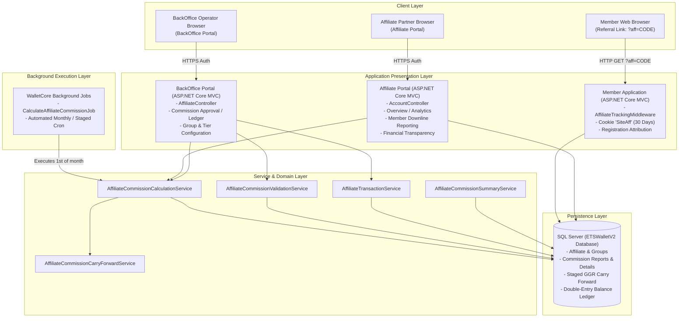
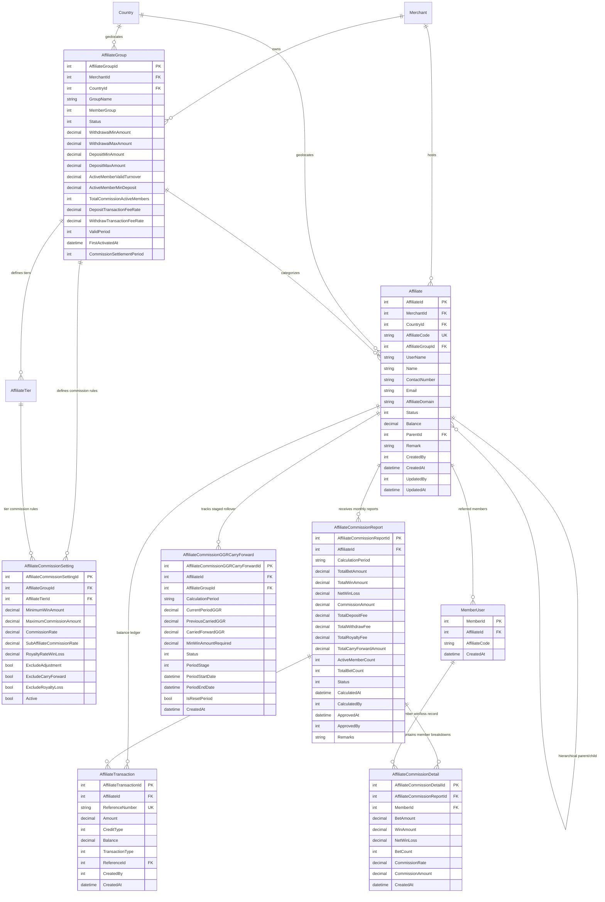
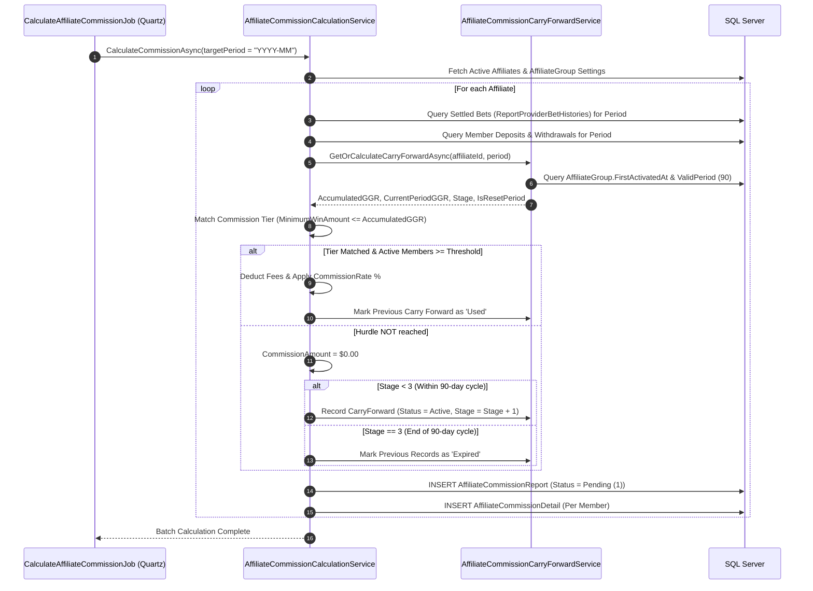
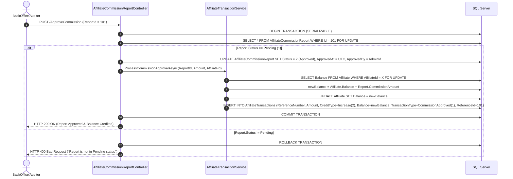

# ETSWalletV2 Affiliate Management System: Technical Architecture & Data Models

**Document Version:** 1.0.0  
**Target Audience:** Software Engineers, Solution Architects, Database Administrators, Technical Leads, QA Automation Engineers  
**Related Documents:**
- `01_BUSINESS_REQUIREMENTS_SPECIFICATION.md`
- `03_COMMISSION_CALCULATION_AND_LOGIC_ENGINE.md`
- `04_AFFILIATE_PORTAL_FUNCTIONAL_SPECIFICATION.md`

---

## 1. Executive Technical Summary & System Topology

The **ETSWalletV2 Affiliate Management System** is a distributed, multi-tenant enterprise affiliate marketing, referral tracking, and commission calculation platform built on **.NET Core 8 / ASP.NET Core**, **Entity Framework Core**, and **Microsoft SQL Server**.

The platform is partitioned into discrete functional assemblies sharing a unified data and domain layer:



---

## 2. Entity-Relationship Diagram (ERD)

The affiliate domain models enforce strict relational integrity, tracking groups, commission tiers, periodic reports, member attribution, staged GGR carry-forwards, and double-entry balance transactions.



---

## 3. Comprehensive Database Schema & Data Dictionary

### 3.1 Table: `Affiliate`
Represents an individual affiliate partner registered in the system.

| Column Name | Data Type | Nullable | Default | Constraints / Descriptions |
| :--- | :--- | :---: | :---: | :--- |
| `AffiliateId` | `int` | NO | IDENTITY(1,1) | **PK**. Unique identifier. |
| `MerchantId` | `int` | NO | - | **FK** -> `Merchant.MerchantId`. Multi-tenant tenancy key. |
| `CountryId` | `int` | NO | - | **FK** -> `Country.CountryId`. Localization & currency scope. |
| `AffiliateCode` | `nvarchar(50)` | NO | - | **Unique Index**. Tracking tag (e.g., `AFF8888`). |
| `AffiliateGroupId`| `int` | NO | - | **FK** -> `AffiliateGroup.AffiliateGroupId`. Rule set link. |
| `UserName` | `nvarchar(100)`| NO | - | Portal login username. Case-insensitive unique. |
| `Name` | `nvarchar(100)`| NO | - | Full legal or corporate name of affiliate. |
| `ContactNumber` | `nvarchar(50)` | YES | NULL | Affiliate telephone/mobile number. |
| `Email` | `nvarchar(100)`| YES | NULL | Affiliate contact email address. |
| `AffiliateDomain`| `nvarchar(255)`| YES | NULL | Custom vanity tracking domain (if assigned). |
| `Status` | `int` | NO | 1 | `1` = Active, `2` = Inactive, `3` = Suspended. |
| `Balance` | `decimal(18,2)`| NO | 0.00 | Current available commission balance. |
| `ParentId` | `int` | YES | NULL | **FK** -> `Affiliate.AffiliateId` (Sub-affiliate hierarchy). |
| `Remark` | `nvarchar(500)`| YES | NULL | Administrative remarks or internal notes. |
| `CreatedBy` | `int` | NO | - | **FK** -> `AdminProfile.AdminId`. |
| `CreatedAt` | `datetime2` | NO | `SYSUTCDATETIME()`| Timestamp of record creation. |
| `UpdatedBy` | `int` | YES | NULL | **FK** -> `AdminProfile.AdminId`. |
| `UpdatedAt` | `datetime2` | YES | NULL | Timestamp of last modification. |

---

### 3.2 Table: `AffiliateGroup`
Defines operational policies, fee structures, activity thresholds, and 90-day cycle rules.

| Column Name | Data Type | Nullable | Default | Constraints / Descriptions |
| :--- | :--- | :---: | :---: | :--- |
| `AffiliateGroupId` | `int` | NO | IDENTITY(1,1) | **PK**. Unique identifier. |
| `MerchantId` | `int` | NO | - | **FK** -> `Merchant.MerchantId`. |
| `CountryId` | `int` | NO | - | **FK** -> `Country.CountryId`. |
| `GroupName` | `nvarchar(100)` | NO | - | Descriptive name (e.g., `VIP Master Tier`). |
| `MemberGroup` | `int` | NO | - | Linkage to customer risk/rebate segment. |
| `Status` | `int` | NO | 1 | `1` = Active, `2` = Inactive. |
| `Remark` | `nvarchar(500)` | YES | NULL | Internal admin comments. |
| `WithdrawalMinAmount` | `decimal(18,2)` | YES | NULL | Minimum single withdrawal limit. |
| `WithdrawalNoMin` | `bit` | YES | 0 | Flag bypassing minimum withdrawal constraint. |
| `WithdrawalMaxAmount` | `decimal(18,2)` | YES | NULL | Maximum single withdrawal limit. |
| `WithdrawalNoMax` | `bit` | YES | 0 | Flag bypassing maximum withdrawal constraint. |
| `WithdrawalDailyCount` | `int` | YES | NULL | Max number of withdrawals permitted per day. |
| `WithdrawalDailyMaxAmount`| `decimal(18,2)` | YES | NULL | Aggregate daily payout cap. |
| `WithdrawalDailyNoMax` | `bit` | YES | 0 | Flag bypassing aggregate daily payout limit. |
| `DepositMinAmount` | `decimal(18,2)` | YES | NULL | Minimum deposit threshold for referred players. |
| `DepositNoMin` | `bit` | YES | 0 | Flag bypassing deposit minimum. |
| `DepositMaxAmount` | `decimal(18,2)` | YES | NULL | Maximum deposit threshold. |
| `DepositNoMax` | `bit` | YES | 0 | Flag bypassing deposit maximum. |
| `ActiveMemberValidTurnover`| `decimal(18,2)` | YES | 0.00 | Min wager required to count member as "Active". |
| `ActiveMemberMinDeposit` | `decimal(18,2)` | YES | 0.00 | Min deposit required to count member as "Active". |
| `TotalCommissionActiveMembers`| `int` | YES | 0 | Minimum active players needed to qualify for commission. |
| `DepositTransactionFeeRate` | `decimal(5,2)` | YES | 0.00 | Percentage deducted on total member deposits (e.g., 2.50%). |
| `WithdrawTransactionFeeRate`| `decimal(5,2)` | YES | 0.00 | Percentage deducted on total member withdrawals (e.g., 1.50%). |
| `ValidPeriod` | `int` | NO | 90 | Duration in days of the GGR carry-forward cycle (default 90). |
| `FirstActivatedAt` | `datetime2` | YES | NULL | **Anchor date** for calculating 90-day cycles & stages. |
| `CommissionSettlementPeriod`| `int` | NO | 30 | Settlement frequency (default 30 days / monthly). |
| `CreatedBy` | `int` | NO | - | Admin user ID. |
| `CreatedAt` | `datetime2` | NO | `SYSUTCDATETIME()`| Creation timestamp. |
| `UpdatedBy` | `int` | YES | NULL | Updating admin user ID. |
| `UpdatedAt` | `datetime2` | YES | NULL | Update timestamp. |

---

### 3.3 Table: `AffiliateCommissionSetting`
Specifies the tiered pay tables, GGR hurdles, royalty rates, and commission percentages.

| Column Name | Data Type | Nullable | Default | Constraints / Descriptions |
| :--- | :--- | :---: | :---: | :--- |
| `AffiliateCommissionSettingId`| `int` | NO | IDENTITY(1,1) | **PK**. Unique identifier. |
| `AffiliateGroupId` | `int` | NO | - | **FK** -> `AffiliateGroup.AffiliateGroupId`. |
| `AffiliateTierId` | `int` | YES | NULL | **FK** -> `AffiliateTier.AffiliateTierId`. Optional link. |
| `MinimumWinAmount` | `decimal(18,2)` | YES | 0.00 | **GGR Threshold**. Min Company GGR required for this tier. |
| `MaximumCommissionAmount` | `decimal(18,2)` | YES | NULL | Hard ceiling on payable commission for this tier. |
| `CommissionRate` | `decimal(5,2)` | YES | 0.00 | Commission rate percentage (e.g., 30.00 for 30%). |
| `SubAffiliateCommissionRate` | `decimal(5,2)` | YES | 0.00 | Commission rate for tier-2 downline affiliates. |
| `RoyaltyRateWinLoss` | `decimal(5,2)` | YES | 0.00 | Game provider royalty rate (e.g., 10.00 for 10%). |
| `ExcludeAdjustment` | `bit` | NO | 0 | Flag to exclude manual adjustments. |
| `ExcludeCarryForward` | `bit` | NO | 0 | Flag to disable negative carry forward. |
| `ExcludeRoyaltyLoss` | `bit` | NO | 0 | Flag to disable royalty fee deduction when net loss is negative. |
| `Active` | `bit` | NO | 1 | Active state flag. |
| `CreatedBy` | `int` | NO | - | Admin user ID. |
| `CreatedAt` | `datetime2` | NO | `SYSUTCDATETIME()`| Creation timestamp. |
| `UpdatedBy` | `int` | YES | NULL | Update admin user ID. |
| `UpdatedAt` | `datetime2` | YES | NULL | Update timestamp. |

---

### 3.4 Table: `AffiliateCommissionReport`
The primary monthly billing statement generated per affiliate.

| Column Name | Data Type | Nullable | Default | Constraints / Descriptions |
| :--- | :--- | :---: | :---: | :--- |
| `AffiliateCommissionReportId`| `int` | NO | IDENTITY(1,1) | **PK**. Unique identifier. |
| `AffiliateId` | `int` | NO | - | **FK** -> `Affiliate.AffiliateId`. Target partner. |
| `CalculationPeriod` | `nvarchar(7)` | NO | - | Period in format `YYYY-MM` (e.g., `2026-08`). |
| `TotalBetAmount` | `decimal(18,2)` | NO | 0.00 | Total valid bet amount across all referred members. |
| `TotalWinAmount` | `decimal(18,2)` | NO | 0.00 | Total payout won by referred members. |
| `NetWinLoss` | `decimal(18,2)` | NO | 0.00 | Company GGR (`TotalBetAmount - TotalWinAmount`). |
| `CommissionAmount` | `decimal(18,2)` | NO | 0.00 | Final computed payable commission. |
| `TotalDepositFee` | `decimal(18,2)` | YES | 0.00 | Deducted deposit transaction fees. |
| `TotalWithdrawFee` | `decimal(18,2)` | YES | 0.00 | Deducted withdrawal transaction fees. |
| `TotalRoyaltyFee` | `decimal(18,2)` | YES | 0.00 | Deducted provider royalty fees. |
| `TotalCarryForwardAmount` | `decimal(18,2)` | YES | 0.00 | GGR carried forward from previous period. |
| `ActiveMemberCount` | `int` | NO | 0 | Number of qualifying active players in period. |
| `TotalBetCount` | `int` | NO | 0 | Total number of settled bet tickets. |
| `Status` | `int` | NO | 1 | `1`=Pending, `2`=Approved, `3`=Paid, `4`=Rejected. |
| `CalculatedAt` | `datetime2` | NO | `SYSUTCDATETIME()`| Timestamp calculation executed. |
| `CalculatedBy` | `int` | NO | - | `0` = System cron job, or AdminId. |
| `ApprovedAt` | `datetime2` | YES | NULL | Timestamp of approval/payment. |
| `ApprovedBy` | `int` | YES | NULL | **FK** -> `AdminProfile.AdminId`. |
| `Remarks` | `nvarchar(500)` | YES | NULL | Approval, recalculation, or rejection notes. |
| `CreatedAt` | `datetime2` | NO | `SYSUTCDATETIME()`| Record creation timestamp. |
| `UpdatedAt` | `datetime2` | YES | NULL | Record modification timestamp. |

---

### 3.5 Table: `AffiliateCommissionDetail`
Granular line-item breakdown of betting volume and commission contribution per member.

| Column Name | Data Type | Nullable | Default | Constraints / Descriptions |
| :--- | :--- | :---: | :---: | :--- |
| `AffiliateCommissionDetailId`| `int` | NO | IDENTITY(1,1) | **PK**. Unique identifier. |
| `AffiliateCommissionReportId`| `int` | NO | - | **FK** -> `AffiliateCommissionReport.AffiliateCommissionReportId`. |
| `MemberId` | `int` | NO | - | **FK** -> `MemberProfile.MemberId`. Referred player. |
| `BetAmount` | `decimal(18,2)` | NO | 0.00 | Total bets wagered by this member in period. |
| `WinAmount` | `decimal(18,2)` | NO | 0.00 | Total wins received by this member in period. |
| `NetWinLoss` | `decimal(18,2)` | NO | 0.00 | Member loss / Company win (`BetAmount - WinAmount`). |
| `BetCount` | `int` | NO | 0 | Number of settled tickets for this member. |
| `CommissionRate` | `decimal(5,2)` | NO | 0.00 | Tier commission rate applied. |
| `CommissionAmount` | `decimal(18,2)` | NO | 0.00 | Proportional commission contribution. |
| `CreatedAt` | `datetime2` | NO | `SYSUTCDATETIME()`| Creation timestamp. |

---

### 3.6 Table: `AffiliateCommissionGGRCarryForward`
Stateful engine tracking staged GGR rollover across the 90-day lifecycle.

| Column Name | Data Type | Nullable | Default | Constraints / Descriptions |
| :--- | :--- | :---: | :---: | :--- |
| `AffiliateCommissionGGRCarryForwardId`| `int` | NO | IDENTITY(1,1) | **PK**. Unique identifier. |
| `AffiliateId` | `int` | NO | - | **FK** -> `Affiliate.AffiliateId`. |
| `AffiliateGroupId` | `int` | NO | - | **FK** -> `AffiliateGroup.AffiliateGroupId`. |
| `CalculationPeriod` | `nvarchar(7)` | NO | - | Period format `YYYY-MM`. |
| `CurrentPeriodGGR` | `decimal(18,2)` | NO | 0.00 | Pure company GGR from current billing period. |
| `PreviousCarriedGGR` | `decimal(18,2)` | NO | 0.00 | Sum of GGR accumulated from prior stages in current cycle. |
| `CarriedForwardGGR` | `decimal(18,2)` | NO | 0.00 | Combined GGR (`CurrentPeriodGGR + PreviousCarriedGGR`). |
| `MinWinAmountRequired`| `decimal(18,2)` | NO | 0.00 | Minimum win amount threshold of lowest tier. |
| `Status` | `int` | NO | 1 | `1`=Active, `2`=Used, `3`=Expired, `4`=Reset. |
| `PeriodStage` | `int` | NO | 1 | Cycle stage (`1`, `2`, or `3`). |
| `PeriodStartDate` | `datetime2` | NO | - | Start date boundary of 30-day stage. |
| `PeriodEndDate` | `datetime2` | NO | - | End date boundary of 30-day stage. |
| `IsResetPeriod` | `bit` | NO | 0 | `1` if this period starts a brand new 90-day cycle. |
| `CreatedAt` | `datetime2` | NO | `SYSUTCDATETIME()`| Timestamp record was created. |
| `UpdatedAt` | `datetime2` | YES | NULL | Timestamp record was updated. |

---

### 3.7 Table: `AffiliateTransactions`
Immutable double-entry balance ledger recording all credits and debits to affiliate accounts.

| Column Name | Data Type | Nullable | Default | Constraints / Descriptions |
| :--- | :--- | :---: | :---: | :--- |
| `AffiliateTransactionId` | `int` | NO | IDENTITY(1,1) | **PK**. Unique identifier. |
| `AffiliateId` | `int` | NO | - | **FK** -> `Affiliate.AffiliateId`. |
| `ReferenceNumber` | `nvarchar(50)` | NO | - | **Unique Index**. Format `TX-AFF-{AffiliateId}-{Timestamp}`. |
| `Amount` | `decimal(18,2)` | NO | 0.00 | Transaction amount. |
| `CreditType` | `int` | NO | - | `1` = Deduct, `2` = Increase. |
| `Balance` | `decimal(18,2)` | NO | 0.00 | Snapshot of affiliate balance **after** transaction. |
| `TransactionType` | `int` | NO | - | `1` = CommissionApproved, `2` = CommissionRejected. |
| `ReferenceId` | `int` | YES | NULL | **FK** -> `AffiliateCommissionReport.AffiliateCommissionReportId`. |
| `CreatedBy` | `int` | NO | - | Admin user ID who approved/rejected report. |
| `CreatedAt` | `datetime2` | NO | `SYSUTCDATETIME()`| Timestamp transaction occurred. |
| `UpdatedBy` | `int` | YES | NULL | Update admin user ID. |
| `UpdatedAt` | `datetime2` | YES | NULL | Update timestamp. |

---

## 4. Enumerations & Status Code Mappings

### 4.1 AffiliateCommissionStatus
Namespace: `ETSWalletV2.WalletCommon.Enums`

```csharp
public enum AffiliateCommissionStatus
{
    Pending = 1,   // Calculated by cron or admin; awaiting management audit
    Approved = 2,  // Approved; funds credited to Affiliate.Balance via ledger
    Paid = 3,      // Disbursed to partner via external payment/bank transfer
    Rejected = 4   // Rejected or retracted; balance deducted if previously approved
}
```

### 4.2 AffiliateCommissionGGRCarryForwardStatus
Namespace: `ETSWalletV2.WalletCommon.Enums`

```csharp
public enum AffiliateCommissionGGRCarryForwardStatus
{
    Active = 1,   // Available to carry forward to the next stage in current cycle
    Used = 2,     // Hurdle was reached; commission paid; rollover marked used
    Expired = 3,  // 90-day cycle expired without reaching hurdle; GGR forfeited
    Reset = 4     // Manually reset by administrative action
}
```

### 4.3 CreditType
Namespace: `ETSWalletV2.WalletCommon.Enums`

```csharp
public enum CreditType
{
    Deduct = 1,    // Balance reduced (e.g., Clawback, Withdrawal)
    Increase = 2   // Balance augmented (e.g., Commission Approved)
}
```

### 4.4 AffiliateTransactionType
Namespace: `ETSWalletV2.WalletCommon.Enums`

```csharp
public enum AffiliateTransactionType
{
    CommissionApproved = 1,  // CreditType: Increase (2)
    CommissionRejected = 2   // CreditType: Deduct (1)
}
```

---

## 5. Architectural Data Flow & Sequence Diagrams

### 5.1 Referral Attribution & Cookie Lifecycle Flow

```mermaid
sequenceDiagram
    autonumber
    actor Player as Member/Visitor
    participant Browser as Client Browser
    participant Middleware as AffiliateTrackingMiddleware (Member App)
    participant Cookie as Browser Cookie (SiteAff)
    participant RegController as RegistrationController
    participant DB as SQL Server (MemberUser)

    Player->>Browser: Clicks referral link: https://portal.com/?aff=AFF8888
    Browser->>Middleware: HTTP GET /?aff=AFF8888
    Middleware->>Cookie: Check if "SiteAff" cookie exists
    alt Cookie does NOT exist
        Middleware->>Cookie: Set-Cookie: SiteAff=AFF8888; Max-Age=30 Days; HttpOnly; SameSite=Lax
    else Cookie ALREADY exists (e.g., AFF1111)
        Note over Middleware,Cookie: First-Touch Policy: Do NOT overwrite. Keep AFF1111!
    end
    Middleware->>Browser: Returns Home / Landing Page
    
    Player->>Browser: Navigates to /Register and submits form
    Browser->>RegController: POST /Register (Reads "SiteAff" from request cookies)
    RegController->>DB: Query Affiliate where AffiliateCode == 'SiteAff'
    alt Valid Affiliate Found
        RegController->>DB: INSERT MemberUser (AffiliateId = aff.AffiliateId, AffiliateCode = 'AFF8888')
    else Invalid or No Cookie
        RegController->>DB: INSERT MemberUser (AffiliateId = NULL, AffiliateCode = NULL)
    end
    DB-->>RegController: Member Created with Attribution
    RegController-->>Browser: Registration Success
```

---

### 5.2 Monthly Commission Calculation & Rollover Flow



---

### 5.3 BackOffice Approval & Balance Credit Flow



---

## 6. Affiliate Web Portal Technical Architecture

### 6.1 Application Structure (`ETSWalletV2.Affiliate`)
The affiliate frontend is built on ASP.NET Core MVC with Razor runtime compilation and modular assets:
- **`Controllers/`**:
  - `AccountController.cs`: Authentication, dashboard overview, member list, expense modals, and profile settings.
  - `LocalizationController.cs`: Multi-language cookie switching (`ETS_AFF_LANGUAGE`).
  - `StatusController.cs`: Health check, session ping, and keepalive endpoints.
- **`Views/`**:
  - `Account/Overview.cshtml`: KPI metric cards, performance charts, and commission statement history.
  - `Account/MyAccount.cshtml`: Tabbed management portal (Member Summary, Downline Member List, Win/Loss modal, Expense breakdown, and Profile).
  - `Shared/_Layout.cshtml`: Responsive sidebar navigation, language selector, and theme injection.
- **`TagHelpers/` & `ViewComponents/`**:
  - `TranslateTagHelper.cs`: Multi-lingual token translation (`<localize key="Overview.TotalBet" />`).
  - `DynamicColorViewComponent.cs`: Tenant-specific dynamic CSS branding.
  - `LanguageSelectorViewComponent.cs`: Active language switcher dropdown.
- **`wwwroot/js/`**:
  - `overview.js`: Highcharts/Chart.js integration, date-range filtering (Year, Quarter, Month), and DataTables rendering.
  - `my-account.js`: Downline member pagination, AJAX modal dialog handlers for win/loss and expenses.

### 6.2 Authentication & Claims Architecture
Affiliate authentication uses ASP.NET Core Cookie Authentication:
- **Cookie Name**: `.AspNetCore.AffiliateAuth`
- **Claim Types Injected**:
  - `ClaimTypes.NameIdentifier`: `AffiliateId` (Integer)
  - `ClaimTypes.Name`: `UserName` (String)
  - `AffiliateCode`: `AffiliateCode` (e.g., `AFF8888`)
  - `MerchantId`: Multi-tenant merchant isolation key
  - `CountryId`: Regional currency isolation key
- **Session Policy**: Sliding expiration (60 minutes default), HttpOnly, Secure, SameSite=Lax.

---

## 7. BackOffice Administrative API & Controllers Reference

| Controller | Action / Method | HTTP Verb | Purpose |
| :--- | :--- | :---: | :--- |
| `AffiliateController` | `Index` | GET | List affiliates with status, balance, and group filters. |
| `AffiliateController` | `Create` | GET / POST | Register a new affiliate partner and assign code. |
| `AffiliateController` | `Edit` | GET / POST | Modify partner profile, contact details, and parent link. |
| `AffiliateController` | `ChangeStatus` | POST | Activate, deactivate, or suspend an affiliate partner. |
| `AffiliateSettingController` | `Groups` | GET / POST | Manage `AffiliateGroup` rules, limits, and fee rates. |
| `AffiliateSettingController` | `CommissionSettings` | GET / POST | Configure tiered commission percentages and GGR hurdles. |
| `AffiliateCommissionController` | `Calculate` | POST | Manually trigger commission calculation for a billing period. |
| `AffiliateCommissionReportController` | `Index` | GET | View all monthly commission reports with filter parameters. |
| `AffiliateCommissionReportController` | `Details` | GET | View line-item breakdown (`AffiliateCommissionDetail`) for a report. |
| `AffiliateCommissionReportController` | `Approve` | POST | Approve a pending report and credit the affiliate's balance. |
| `AffiliateCommissionReportController` | `Reject` | POST | Reject a pending report or execute clawback on an approved report. |
| `AffiliateTransactionController` | `Index` | GET | Audit log of all double-entry ledger transactions. |

---

## 8. Database Concurrency & Financial Transaction Integrity

1. **ACID Concurrency via Serializable Transactions:**
   - Balance mutations in `AffiliateTransactionService` execute within an explicit database transaction (`BeginTransactionAsync(IsolationLevel.Serializable)`).
   - Rows in `Affiliate` and `AffiliateCommissionReport` are locked during status updates to prevent race conditions from concurrent admin approvals.
2. **Double-Entry Ledger Immutability:**
   - The `AffiliateTransactions` table is **append-only**.
   - No `UPDATE` or `DELETE` operations are ever executed against `AffiliateTransactions`.
   - Any reversal or clawback inserts a countervailing record of type `CommissionRejected` with `CreditType = Deduct (1)`.
3. **Auditability & Traceability:**
   - Every financial state change stores `CreatedBy` (AdminId), `CreatedAt` (UTC timestamp), and `ReferenceId` (linking back to the source `AffiliateCommissionReportId`).
