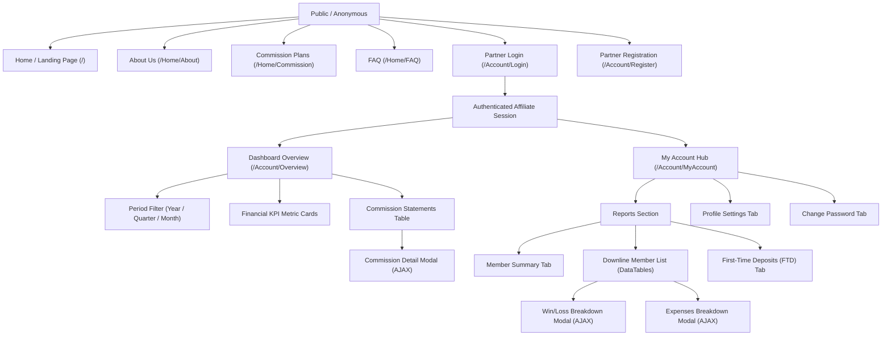

# ETSWalletV2 Affiliate Management System: Affiliate Portal Functional Specification

**Document Version:** 1.0.0  
**Target Audience:** Frontend Developers, QA Engineers, UI/UX Designers, Product Managers  
**Related Documents:**
- `01_BUSINESS_REQUIREMENTS_SPECIFICATION.md`
- `02_TECHNICAL_ARCHITECTURE_AND_DATA_MODELS.md`
- `03_COMMISSION_CALCULATION_AND_LOGIC_ENGINE.md`

---

## 1. Executive Portal Scope & User Persona

The **ETSWalletV2 Affiliate Portal** (`Affiliate` web project) provides registered marketing partners and agency affiliates with a secure, responsive, multi-tenant portal to monitor referral performance, inspect downline member activity, verify monthly commission calculations, and audit expense pass-throughs.

### Primary User Persona:
- **Affiliate Partner / Webmaster:** Direct marketing partner driving traffic to the operator platform.
- **Key Objectives:**
  - Retrieve tracked referral links and vanity domains.
  - Review real-time and historical betting volume across referred players.
  - Verify commission billing statements and understand fee deductions (transaction fees, game royalties).
  - Inspect 90-day staged GGR rollover progress.
  - Maintain contact details and secure login credentials.

---

## 2. Information Architecture & Navigation Sitemap



---

## 3. Detailed Screen & Feature Specifications

### 3.1 Screen: Partner Authentication & Session Management
- **Routes:** `GET /Account/Login`, `POST /Account/Login`, `POST /Account/Logout`
- **Controller:** `AccountController.cs`

#### UI Elements & Behavioral Rules:
1. **Login Form:**
   - Fields: `Username` (Required, text), `Password` (Required, password mask), `RememberMe` (Checkbox).
   - Form Submission: Executes `POST /Account/Login`.
   - Security Enforcement:
     - Verifies user exists in ASP.NET Core Identity.
     - Enforces role verification: User must possess the `affiliate` role.
     - Account lockout triggers automatically after 5 consecutive failed attempts.
2. **Referral Link Quick-Action Widget:**
   - Upon successful login, the top navigation header renders the affiliate's unique referral code badge:
     `Your Referral Code: AFF8888 [Copy Link] [Open Site]`
   - Clicking `[Copy Link]` copies `https://membersite.com/?aff=AFF8888` to the system clipboard and triggers a green success toast (`showToast()`).
   - Clicking `[Open Site]` opens the referral landing page in a new browser tab.

---

### 3.2 Screen: Dashboard Overview (`/Account/Overview`)
- **Route:** `GET /Account/Overview`
- **Data Hydration Endpoints:**
  - `GET /Account/GetOverviewSummaryByPeriod?year={Y}&quarter={Q}&month={M}`
  - `GET /Account/GetCommissionReportsByPeriod?year={Y}&quarter={Q}&month={M}`
  - `GET /Account/GetCommissionDetails?affiliateCommissionReportId={Id}`
- **Client Script:** `wwwroot/js/overview.js`

#### UI Layout & Components:
```
+-----------------------------------------------------------------------------------------+
| [Year Dropdown: 2026 v]  [Quarter: All v]  [Month: August v]              [Filter Button] |
+-----------------------------------------------------------------------------------------+
|  TOTAL BETS     |  TOTAL WINS     |  NET WIN/LOSS   |  COMMISSION    |  CARRIED GGR     |
|  $200,000.00    |  $160,000.00    |  $40,000.00     |  $10,200.00    |  $0.00 (Stage 1) |
+-----------------------------------------------------------------------------------------+
|  COMMISSION STATEMENTS                                                                  |
|  Period   | Turnover    | Win/Loss   | Fees      | Commission | Status    | Actions     |
|  ---------+-------------+------------+-----------+------------+-----------+-------------|
|  2026-08  | $200,000.00 | $40,000.00 | $6,000.00 | $10,200.00 | [Approved]| [View Detail]|
|  2026-07  | $100,000.00 |- $20,000.00| $2,100.00 | $0.00      | [Pending] | [View Detail]|
+-----------------------------------------------------------------------------------------+
```

#### Field Mappings & Formulas:
1. **Period Filter Controls:**
   - **Year:** Pre-populated from affiliate registration year to current year.
   - **Quarter:** All, Q1 (Jan-Mar), Q2 (Apr-Jun), Q3 (Jul-Sep), Q4 (Oct-Dec). Selecting a quarter filters the Month dropdown.
   - **Month:** All, or 1 to 12.
2. **KPI Metric Cards:**
   - **Total Bets:** Sourced from `Report.TotalBetAmount`.
   - **Total Wins:** Sourced from `Report.TotalWinAmount`.
   - **Net Win/Loss (Company GGR):** Displays `Report.NetWinLoss`. Color-coded: Green if positive (operator profit), Red if negative.
   - **Commission Earned:** Total approved or payable commission (`Report.CommissionAmount`).
   - **Carried Forward GGR:** Displays `TotalCarryForwardAmount` and current 90-day stage badge (e.g., `Stage 2 / Cycle 1`).
3. **Commission Statement Table:**
   - Displays historical statements from `AffiliateCommissionReport`.
   - **Status Badges:**
     - `Pending (1)`: Yellow/Warning badge `<span class="badge bg-warning">Pending</span>`
     - `Approved (2)`: Blue/Primary badge `<span class="badge bg-primary">Approved</span>`
     - `Paid (3)`: Green/Success badge `<span class="badge bg-success">Paid</span>`
     - `Rejected (4)`: Red/Danger badge `<span class="badge bg-danger">Rejected</span>`
4. **Action: "View Detail" Modal (`#commissionDetailsModal`):**
   - Triggers `GET /Account/GetCommissionDetails?affiliateCommissionReportId={Id}`.
   - Renders line-item breakdown of all members in `AffiliateCommissionDetail`:
     - Member Code (masked for privacy: `usr***92`)
     - Bet Volume & Win Amount
     - Member Net Loss Contribution
     - Proportional Commission Share ($)

---

### 3.3 Screen: My Account Hub (`/Account/MyAccount`)
- **Route:** `GET /Account/MyAccount?tab={tabName}&activeSection={section}`
- **Client Script:** `wwwroot/js/my-account.js`
- **Tabs:**
  1. `member-summary`
  2. `member` (Downline Member Directory)
  3. `first-time-deposit` (FTD Report)
  4. `profile`
  5. `password`

---

#### 3.3.1 Tab: Downline Member Directory (`#member`)
Renders an interactive, searchable DataTables grid showing all referred members registered under the affiliate's tracking code.

- **Data Hydration Endpoint:** `GET /Account/GetMembers?fromDate={D1}&toDate={D2}`
- **Table Columns:**
  1. **Member Code:** Account username or member code.
  2. **Registration Date:** Formatted in local browser timezone (`convertToLocalDate()`).
  3. **Total Deposit Amount:** Aggregate completed deposits.
  4. **Deposit Count:** Total number of deposit transactions.
  5. **Total Bet Amount:** Cumulative valid settled turnover.
  6. **Total Win Amount:** Cumulative settled payouts.
  7. **Net Win/Loss:** Member loss (operator win).
  8. **Actions:**
     - `[Win/Loss Details]` button: Opens Provider Breakdown Modal.
     - `[Expenses Details]` button: Opens Pass-Through Fee Modal.

---

#### 3.3.2 Modal: Win/Loss Details (`#ggrDetailsModal`)
- **Trigger:** Clicking `[Win/Loss Details]` on a member row or top-level report.
- **Data Endpoint:** `GET /Account/GetGGRDetails?fromDate={D1}&toDate={D2}`
- **Data Presentation:**
  - Segregates gaming activity by Game Provider (e.g., Pragmatic Play, Evolution Gaming, Spadegaming) and Product Category (Slots, Live Casino, Sportsbook).
  - Displays:
    - Provider Name
    - Category
    - Total Bets ($)
    - Total Wins ($)
    - Net GGR ($)
    - Total Ticket Count

---

#### 3.3.3 Modal: Expenses Breakdown (`#expensesDetailsModal`)
- **Trigger:** Clicking `[Expenses]` on report view.
- **Data Endpoint:** `GET /Account/GetExpensesBreakdown?fromDate={D1}&toDate={D2}`
- **Data Presentation:**
  - Audits all expense deductions reducing the affiliate's commission:
    - **Deposit Fees:** Total Member Deposits $\times$ Group Deposit Fee Rate (e.g., \$80,000 $\times$ 2.0% = \$1,600.00).
    - **Withdrawal Fees:** Total Member Withdrawals $\times$ Group Withdrawal Fee Rate (e.g., \$40,000 $\times$ 1.0% = \$400.00).
    - **Provider Royalty Fees:** Net Win/Loss $\times$ Matched Tier Royalty Rate (e.g., \$40,000 $\times$ 10.0% = \$4,000.00).
    - **Total Deductions:** Sum of transaction fees + royalties.

---

#### 3.3.4 Tab: First-Time Deposits (FTD) (`#first-time-deposit`)
- **Data Endpoint:** `GET /Account/GetFirstTimeDeposits?fromDate={D1}&toDate={D2}`
- **Purpose:** Tracks player conversion velocity and initial acquisition quality.
- **Columns:**
  - Member Code
  - Registration Timestamp
  - First Deposit Timestamp
  - Conversion Duration (Hours from registration to first deposit)
  - FTD Deposit Amount
  - Payment Method Used

---

#### 3.3.5 Tab: Profile & Security Management (`#profile`, `#password`)
- **Profile Update Endpoint:** `POST /Account/UpdateProfile`
  - Input Model: `FullName`, `Email`, `ContactNumber`
  - Validation: Valid email format, telephone string constraints.
- **Password Change Endpoint:** `POST /Account/ChangePassword`
  - Input Model: `CurrentPassword`, `NewPassword`, `ConfirmPassword`
  - Validation: Minimum 6 characters, mixed case, numeric/special characters. Identity password validator handles hashing and security stamp mutation.

---

## 4. Internationalization & Multi-Tenant Theming

### 4.1 Localization Subsystem
- **Mechanism:** Driven by `LocalizationController.cs`, `TranslateTagHelper`, and `LanguageSelectorViewComponent`.
- **Supported Languages:** English (`en`), Chinese Simplified (`zh-CN`), Thai (`th`), Indonesian (`id`), Vietnamese (`vi`).
- **Persistence:** Culture cookie stored on client: `ETS_AFF_LANGUAGE`.
- **View Integration:**
  ```html
  <localize key="Overview.TotalBet" default="Total Bets" />
  <localize key="Overview.CommissionAmount" default="Commission Amount" />
  ```

### 4.2 Dynamic Brand Theming (`DynamicColorViewComponent`)
- The portal supports multi-tenant branding for different white-label operators.
- `DynamicColorViewComponent` injects tenant-specific CSS variables dynamically at runtime:
  ```css
  :root {
      --primary-color: #1a73e8;
      --accent-color: #fbbc04;
      --sidebar-bg: #202124;
      --card-radius: 8px;
  }
  ```

---

## 5. Client-Side Error Handling & Toast Architecture

The portal implements consistent toast notifications and defensive AJAX wrappers:
- **AJAX Wrapper:** All API requests pass through `fetch()` with `.then(res => res.json())` and catch blocks.
- **Error Display:** Server error responses render into Bootstrap 5 Toast containers positioned fixed at `top: 20px; right: 20px; z-index: 9999;`.
- **Session Expiry Detection:** If an AJAX call returns HTTP 401 or redirects to `/Account/Login`, the script detects the redirect and transitions the user smoothly to the login screen with `returnUrl`.
