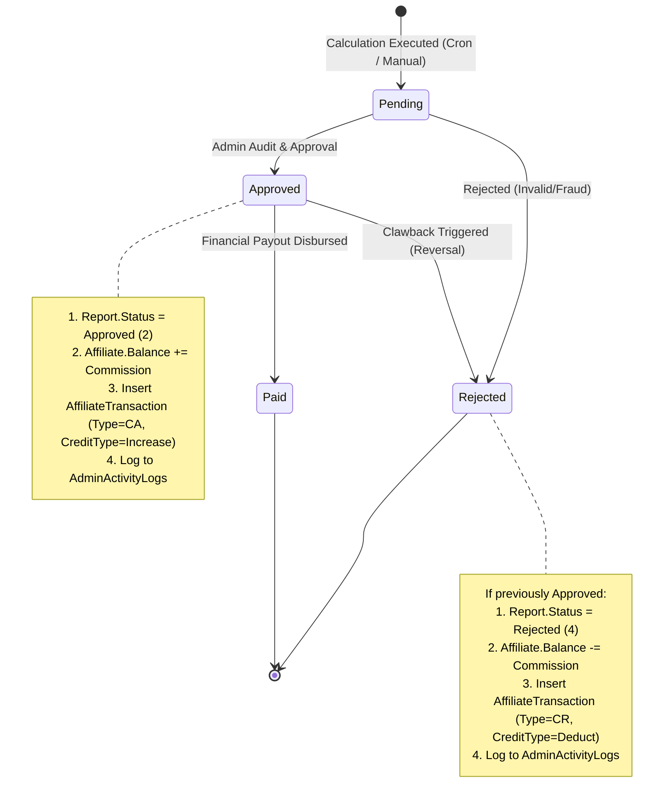

# ETSWalletV2 Affiliate Management System: BackOffice Admin & Financial Workflow Guide

**Document Version:** 1.0.0  
**Target Audience:** BackOffice Administrators, Finance Managers, Compliance Officers, Technical Support Leads  
**Related Documents:**
- `01_BUSINESS_REQUIREMENTS_SPECIFICATION.md`
- `02_TECHNICAL_ARCHITECTURE_AND_DATA_MODELS.md`
- `03_COMMISSION_CALCULATION_AND_LOGIC_ENGINE.md`
- `07_QA_TESTING_AND_VERIFICATION_MATRIX.md`

---

## 1. Operational Overview & Administrative Roles

The **BackOffice Management Portal** (`BackOffice` web project) provides administrative operators with end-to-end governance over the affiliate ecosystem:
- Onboarding and managing affiliate partner profiles and referral codes.
- Defining operational affiliate groups, withdrawal thresholds, and tiered commission schedules.
- Triggering and auditing monthly commission calculation batches.
- Executing financial workflows: statement approval, double-entry balance crediting, and clawback reversals.
- Reviewing immutable ledger transactions and administrator activity audit logs.



---

## 2. Administrative Security & Permissions Architecture

All affiliate operations within the BackOffice are protected by a triple-layer security boundary:

1. **Role-Based Dynamic Authorization (`[DynamicAuthorize]`):**
   - Controllers and actions enforce fine-grained permissions verified through `MenuService.HasPermissionAsync()`.
   - Granular actions: `view`, `create`, `edit`, `approve`, `reject`, `export`.
2. **Network IP Whitelisting (`[IPWhitelist]`):**
   - Critical financial endpoints (e.g., `AffiliateCommissionController`, `AffiliateCommissionReportController`) reject HTTP traffic not originating from authorized corporate VPN or office IP CIDR blocks.
3. **Cross-Site Request Forgery (CSRF) Tokens (`[ValidateAntiForgeryToken]`):**
   - Every state-altering HTTP POST request requires a valid anti-forgery token in the payload or request headers.

---

## 3. Affiliate Partner Lifecycle Administration (`AffiliateController`)

### 3.1 Partner Registration & Onboarding
- **Route:** `GET /Affiliate/Create`, `POST /Affiliate/Create`
- **Controller Action:** `AffiliateController.Create`
- **Required Fields:**
  - `MerchantId`: Select tenant operator.
  - `CountryId`: Select operational currency and regional jurisdiction.
  - `AffiliateCode`: Unique marketing tracking tag (e.g., `AFF8888`). Alphanumeric, max 50 chars.
  - `AffiliateGroupId`: Select affiliate group policy and tier assignment.
  - `UserName`: Portal login credential.
  - `Name`: Full legal individual or corporate entity name.
  - `ContactNumber` & `Email`: Primary communication channels.
  - `ParentId`: Optional. Designates an existing affiliate as the parent for multi-tier/sub-affiliate commission splits.
- **Initial State:** Balance initialized to `$0.00`, Status set to `Active (1)`.

### 3.2 Partner Status Lifecycle Management
- **Route:** `POST /Affiliate/ChangeStatus`
- **Supported Status Transitions:**
  - `Active (1)` $\to$ `Inactive (2)`: Disables affiliate portal login. Referral tracking remains intact.
  - `Active (1)` $\to$ `Suspended (3)`: Hard lock. Affiliate portal login blocked; tracking middleware ignores clicks; commission calculations are bypassed.
  - `Inactive / Suspended` $\to$ `Active (1)`: Restores full access.

---

## 4. Group & Commission Policy Configuration (`AffiliateSettingController`)

### 4.1 Managing Affiliate Groups (`AffiliateGroup`)
Affiliate groups define operational parameters and activity constraints applied to cohorts of affiliate partners.

#### Configuration Parameters:
1. **Activity Qualification Thresholds:**
   - `ActiveMemberValidTurnover`: Minimum valid wagering turnover a referred member must generate in a calendar month to count as an active member (e.g., \$500.00).
   - `ActiveMemberMinDeposit`: Minimum completed deposits a player must make to count as active (e.g., \$100.00).
   - `TotalCommissionActiveMembers`: Minimum number of qualifying active players an affiliate must maintain to receive commission. If the threshold is not met, commission is zeroed out.
2. **Transaction Fee Pass-Through Rates:**
   - `DepositTransactionFeeRate`: Fee deducted from gross profit for payment gateway processing on deposits (e.g., 2.00%).
   - `WithdrawTransactionFeeRate`: Fee deducted for payout processing on withdrawals (e.g., 1.00%).
3. **90-Day Staged Cycle Parameters:**
   - `ValidPeriod`: Fixed at `90` days.
   - `FirstActivatedAt`: Anchor timestamp initiating the 90-day calculation epochs.
   - `CommissionSettlementPeriod`: Default `30` days (monthly settlement).

### 4.2 Tiered Commission Matrix (`AffiliateCommissionSetting`)
Within an `AffiliateGroup`, administrators configure multiple tiered commission levels evaluated in descending order of turnover/GGR:

| Setting Parameter | Technical Description | Example Value |
| :--- | :--- | :--- |
| `MinimumWinAmount` | Minimum Company GGR required to trigger this tier | \$30,000.00 |
| `CommissionRate` | Percentage of Adjusted Net Loss paid to partner | 30.00% |
| `SubAffiliateCommissionRate` | Percentage paid to parent affiliate on child GGR | 5.00% |
| `RoyaltyRateWinLoss` | Royalty rate deducted for game software providers | 10.00% |
| `MaximumCommissionAmount` | Hard cap on maximum payable commission in a single period | \$15,000.00 (or NULL for uncapped) |
| `ExcludeCarryForward` | If true, disables 90-day negative GGR rollover | `false` |
| `ExcludeRoyaltyLoss` | If true, ignores royalty deduction when GGR is negative | `false` |

---

## 5. Commission Calculation & Validation Workflows

### 5.1 Manual Calculation Execution
While automated Quartz cron jobs execute calculations on the 1st of every month, administrators can manually trigger calculations or force recalculations through the BackOffice.

- **Route:** `POST /AffiliateCommission/CalculateCommission`
- **Request Payload:**
  ```json
  {
    "merchantId": 1,
    "year": 2026,
    "month": 8,
    "affiliateId": null,
    "forceRecalculate": true
  }
  ```
- **Execution Safeguards:**
  - Calculations for the current or future months are blocked (`requestDate < currentMonth`).
  - Setting `affiliateId` targets a single partner for rapid testing or audit. Leaving it `null` processes all active affiliates under the merchant.
  - Setting `forceRecalculate = true` purges existing unapproved reports and recalculates with current database state.

### 5.2 Automated Validation Engine (`AffiliateCommissionValidationService`)
Prior to approving a commission batch, the BackOffice runs a comprehensive validation suite:
- **Turnover Reconciler:** Verifies that the sum of `DepositBet` and `BonusBet` across all member detail records matches raw settled records in `ReportProviderBetHistories`.
- **Payment Fee Sanity Check:** Confirms that deducted deposit and withdrawal fees match actual payment logs in `TransDeposits` and `TransWithdraws`.
- **GGR Carry Forward Continuity Check:** Validates that `PreviousCarriedGGR` matches the preceding period's carry-forward ledger record without mathematical drift.
- **Cap Verification:** Verifies that no commission exceeds `MaximumCommissionAmount`.

---

## 6. Financial Settlement & Double-Entry Ledger Management

The BackOffice provides strict double-entry ledger enforcement for commission statements via `AffiliateCommissionReportController` and `AffiliateTransactionService`.

```
===================================================================================
                   COMMISSION APPROVAL / REJECTION WORKFLOW
===================================================================================

[ Pending Report: ID 101, Amount: $10,200.00, Affiliate: AFF8888, Bal: $5,000.00 ]
                                      |
         +----------------------------+----------------------------+
         |                                                         |
  (Admin Clicks "Approve")                                  (Admin Clicks "Reject")
         |                                                         |
         v                                                         v
[ Report.Status = Approved (2) ]                          [ Report.Status = Rejected (4) ]
[ Affiliate.Balance += $10,200 ]                          [ No Balance Change ]
[ New Balance: $15,200.00 ]                               [ Audit Log Created ]
[ Ledger Entry Created:        ]
  - Type: CommissionApproved (1)
  - Ref: EV-CA-20260901-0001
  - CreditType: Increase (2)
  - Amount: $10,200.00
  - Balance: $15,200.00
         |
         +----------------------------+
                                      |
                           (Clawback / Reversal Needed)
                                      |
                                      v
                       (Admin Clicks "Reject" on Approved)
                                      |
                                      v
                       [ Report.Status = Rejected (4) ]
                       [ Affiliate.Balance -= $10,200 ]
                       [ New Balance: $5,000.00 ]
                       [ Ledger Entry Created:        ]
                         - Type: CommissionRejected (2)
                         - Ref: EV-CR-20260901-0002
                         - CreditType: Deduct (1)
                         - Amount: $10,200.00
                         - Balance: $5,000.00
```

---

### 6.1 Statement Approval Procedure (`ApproveCommission`)
- **Route:** `POST /AffiliateCommissionReport/ApproveCommission`
- **Request Payload:** `{ "affiliateCommissionReportId": 101 }`
- **Preconditions:**
  - Report must exist and possess `Status == Pending (1)`.
  - Report with `Status == Approved` or `Status == Paid` returns HTTP 400 error.
- **Execution Steps (Within Serializable DB Transaction):**
  1. Update `AffiliateCommissionReport`:
     - `Status = Approved (2)`
     - `ApprovedAt = DateTime.UtcNow`
     - `ApprovedBy = CurrentAdminId`
  2. Mutate Partner Balance:
     - `Affiliate.Balance += Report.CommissionAmount`
  3. Generate Unique Transaction Reference:
     - Format: `{MerchantPrefix}-CA-{YYYYMMDDHHmmss}-{AffiliateId}` (e.g., `EV-CA-20260901120000-88`)
  4. Insert Immutable Ledger Record (`AffiliateTransactions`):
     - `AffiliateId = Report.AffiliateId`
     - `ReferenceNumber = referenceNumber`
     - `Amount = Report.CommissionAmount`
     - `CreditType = CreditType.Increase (2)`
     - `Balance = Affiliate.Balance` (Snapshot of balance immediately post-credit)
     - `TransactionType = AffiliateTransactionType.CommissionApproved (1)`
     - `ReferenceId = Report.AffiliateCommissionReportId`
  5. Insert Admin Audit Log (`AdminActivityLogs`):
     - Records old status (`Pending`), new status (`Approved`), Admin ID, and IP address.

---

### 6.2 Statement Rejection & Clawback Procedure (`RejectCommission`)
- **Route:** `POST /AffiliateCommissionReport/RejectCommission`
- **Request Payload:** `{ "affiliateCommissionReportId": 101 }`
- **Case 1: Rejecting a `Pending (1)` Report:**
  - Update `AffiliateCommissionReport.Status = Rejected (4)`.
  - No balance mutation occurs.
  - Audit log recorded.
- **Case 2: Rejecting an `Approved (2)` Report (Financial Clawback):**
  - If a fraud pattern, irregular syndicate betting, or post-audit calculation error is discovered after approval:
  1. Verify report is not already `Paid (3)`. (Paid reports cannot be rejected directly).
  2. Deduct funds from partner balance:
     - `Affiliate.Balance -= Report.CommissionAmount`
  3. Generate Clawback Reference:
     - Prefix: `{MerchantPrefix}-CR-...` (Commission Rejected)
  4. Insert Countervailing Ledger Record (`AffiliateTransactions`):
     - `CreditType = CreditType.Deduct (1)`
     - `TransactionType = AffiliateTransactionType.CommissionRejected (2)`
     - `Amount = Report.CommissionAmount`
     - `Balance = Affiliate.Balance` (Snapshot post-deduction)
     - `ReferenceId = Report.AffiliateCommissionReportId`
  5. Update `AffiliateCommissionReport.Status = Rejected (4)`.
  6. Audit log recorded in `AdminActivityLogs`.

---

## 7. Audit Logging & System Diagnostics

Administrators can inspect all historical financial events via `AffiliateTransactionController`:
- **Route:** `GET /AffiliateTransaction/Index`
- **Audit Columns:**
  - Transaction Reference Number
  - Timestamp (UTC & Converted Local Time)
  - Affiliate Username & Code
  - Transaction Type Badge (`Commission Approved` / `Commission Rejected`)
  - Credit Type (`Increase` [Green] / `Deduct` [Red])
  - Transaction Amount
  - Post-Transaction Balance Snapshot
  - Source Statement Reference Link (`AffiliateCommissionReportId`)
  - Executed By (Admin Username or `0` for System Cron)
