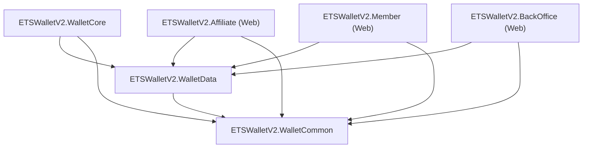

# ETSWalletV2 Affiliate Management System: Developer Integration & Code Reference

**Document Version:** 1.0.0  
**Target Audience:** Senior Software Engineers, Full-Stack Developers, DevOps Engineers, System Integrators  
**Related Documents:**
- `02_TECHNICAL_ARCHITECTURE_AND_DATA_MODELS.md`
- `03_COMMISSION_CALCULATION_AND_LOGIC_ENGINE.md`
- `05_BACKOFFICE_ADMIN_AND_WORKFLOW_GUIDE.md`

---

## 1. Solution Structure & Assembly Dependencies

The affiliate subsystem is distributed across modular .NET Core 8 class libraries and web application projects within `ETSWalletV2.sln`:

```
ETSWalletV2/
|-- WalletCommon/                 # Cross-cutting primitives, enums, constants
|   |-- Enums/                    # AffiliateCommissionStatus, CreditType, etc.
|   +-- Utils/                    # Constants.cs, DateTimeHelper.cs
|-- WalletData/                   # Persistence and service business logic
|   |-- Data/                     # ApplicationDbContext.cs
|   |-- Models/                   # Affiliate.cs, AffiliateCommissionReport.cs, etc.
|   +-- Services/                 # AffiliateCommissionCalculationService.cs, etc.
|-- WalletCore/                   # Cron scheduling and background workers
|   +-- Jobs/                     # CalculateAffiliateCommissionJob.cs
|-- Affiliate/                    # Partner Web Portal (ASP.NET Core MVC)
|   |-- Controllers/              # AccountController.cs, LocalizationController.cs
|   |-- Views/                    # Overview.cshtml, MyAccount.cshtml
|   +-- wwwroot/js/               # overview.js, my-account.js
|-- Member/                       # Player Portal
|   +-- Middleware/               # AffiliateTrackingMiddleware.cs
+-- BackOffice/                   # Administrative Management Portal
    +-- Controllers/              # AffiliateCommissionReportController.cs, etc.
```

### Assembly Dependency Graph:


---

## 2. Core Service Classes & API Reference

### 2.1 `AffiliateCommissionCalculationService`
Namespace: `ETSWalletV2.WalletData.Services`  
Primary engine computing monthly GGR, fees, tier matching, and commission statements.

#### Key Methods:

##### `CalculateCommissionAsync`
```csharp
public async Task<AffiliateCommissionCalculationResponse> CalculateCommissionAsync(
    AffiliateCommissionCalculationRequest request, 
    int calculatedBy)
```
- **Description:** Entry point for executing commission calculation across all affiliates (or a specified single affiliate) for a specific `Year` and `Month`.
- **Parameters:**
  - `request`: Contains `MerchantId`, `Year`, `Month`, optional `AffiliateId`, and `ForceRecalculate` flag.
  - `calculatedBy`: Admin ID executing the request (or `0` for automated cron job).
- **Returns:** `AffiliateCommissionCalculationResponse` containing execution status, processed count, total commission amount, and summary list.
- **Exceptions:** Throws `InvalidOperationException` if calculating for current or future months.

##### `GetMembersBettingDataAsync`
```csharp
private async Task<List<MemberBettingData>> GetMembersBettingDataAsync(
    int affiliateId, 
    DateTime startDate, 
    DateTime endDate)
```
- **Description:** Queries `ReportProviderBetHistories` and aggregates turnover, separating `DepositBet`, `DepositWin`, `BonusBet`, and `BonusWin`. Joins `TransDeposits` and `TransWithdraws` to aggregate payment processing fees.
- **Filter Criteria:**
  - `b.TransactionStatus == (int)BetTransactionStatus.Success`
  - `b.SettlementStatus == (int)BetSettlementStatus.Settled`
  - `b.BetTime >= startDate && b.BetTime < endDate`

##### `CalculateCommissionAsync` (Internal Formula Engine)
```csharp
private async Task<CommissionCalculationResult> CalculateCommissionAsync(
    List<MemberBettingData> membersBettingData, 
    AffiliateCommissionSetting commissionSetting,
    int affiliateId,
    string period,
    decimal accumulatedGGR,
    decimal carriedForwardGGR)
```
- **Description:** Applies fee pass-throughs, calculates provider royalties, computes `AdjustedNetLoss`, applies tier commission percentage, and enforces `MaximumCommissionAmount` caps.

---

### 2.2 `AffiliateCommissionCarryForwardService`
Namespace: `ETSWalletV2.WalletData.Services`  
Manages multi-stage 90-day GGR rollover, stage calculations, and expiration rules.

#### Key Methods:

##### `GetAccumulatedGGRAsync`
```csharp
public async Task<GGRAccumulationResult> GetAccumulatedGGRAsync(
    int affiliateId,
    int affiliateGroupId,
    string currentPeriod,
    decimal currentCompanyGGR)
```
- **Description:** Non-mutating read query computing the total accumulated GGR (`CurrentPeriodGGR + PreviousPeriodCarriedGGR`) for tier evaluation.

##### `ProcessGGRCarryForward`
```csharp
public async Task<CarryForwardResult> ProcessGGRCarryForward(
    int affiliateId, 
    int affiliateGroupId, 
    string calculationPeriod,
    decimal currentPeriodGGR)
```
- **Description:** Stateful engine. Evaluates 90-day cycle epoch, expires stale records from prior cycles, writes new carry forward records, or marks records as `Used (2)` if the tier threshold was reached.

##### `CalculateStageInfoByPeriodAsync`
```csharp
private async Task<CycleStageInfo> CalculateStageInfoByPeriodAsync(
    int affiliateGroupId, 
    string calculationPeriod)
```
- **Description:** Mathematical calculation resolving `CycleNumber`, `CurrentStage` (1, 2, or 3), `StageStartDate`, `StageEndDate`, and `IsNewCycle` based on `AffiliateGroup.FirstActivatedAt`.

---

### 2.3 `AffiliateTransactionService`
Namespace: `ETSWalletV2.WalletData.Services`  
Maintains the append-only double-entry financial ledger for affiliate balances.

#### Key Methods:

##### `CreateTransactionAsync`
```csharp
public async Task<AffiliateTransaction> CreateTransactionAsync(
    AffiliateTransaction transaction)
```
- **Description:** Inserts an immutable transaction record into `AffiliateTransactions`.
- **Safety Guarantee:** Executed within an explicit `IDbContextTransaction` to ensure atomicity between `Affiliate.Balance` mutations and ledger logging.

##### `GenerateTransReferenceNumber`
```csharp
public string GenerateTransReferenceNumber(
    string merchantPrefix, 
    string transactionTypePrefix)
```
- **Description:** Generates unique tracking reference numbers.
- **Format:** `{merchantPrefix}-{typePrefix}-{timestamp}-{randomSuffix}`  
  Example: `EV-CA-20260901123045-8831` (Commission Approved), `EV-CR-20260901123512-4412` (Commission Rejected).

---

### 2.4 `AffiliateTrackingMiddleware`
Namespace: `Member.Middleware`  
ASP.NET Core HTTP pipeline middleware intercepting incoming traffic on player-facing domains.

```csharp
public async Task InvokeAsync(HttpContext context)
{
    if (context.Request.Query.TryGetValue("aff", out var affiliateCode))
    {
        var code = affiliateCode.ToString();
        if (!string.IsNullOrWhiteSpace(code))
        {
            // First-Touch Policy: Do not overwrite if cookie already exists
            if (!context.Request.Cookies.ContainsKey("SiteAff"))
            {
                var cookieOptions = new CookieOptions
                {
                    HttpOnly = true,
                    Secure = context.Request.IsHttps,
                    SameSite = SameSiteMode.Lax,
                    Expires = DateTime.UtcNow.AddDays(30),
                    IsEssential = true
                };
                context.Response.Cookies.Append("SiteAff", code, cookieOptions);
            }
        }
    }
    await _next(context);
}
```

---

## 3. Dependency Injection (DI) Service Registration

In `Program.cs` / `Startup.cs` across `Affiliate`, `BackOffice`, and `WalletCore` host projects, affiliate services are registered into the `IServiceCollection` with scoped lifecycles:

```csharp
public static void AddAffiliateServices(this IServiceCollection services, IConfiguration configuration)
{
    // Persistence & Core Services
    services.AddScoped<AffiliateService>();
    services.AddScoped<AffiliateCommissionCalculationService>();
    services.AddScoped<AffiliateCommissionCarryForwardService>();
    services.AddScoped<AffiliateCommissionValidationService>();
    services.AddScoped<AffiliateTransactionService>();
    services.AddScoped<AffiliateCommissionSummaryService>();

    // Timezone & Localization
    services.AddScoped<TimezoneService>();

    // Quartz Background Job Handlers
    services.AddTransient<CalculateAffiliateCommissionJob>();
}
```

---

## 4. Entity Framework Core Configuration & Decimal Precision

To prevent rounding truncation in financial calculations, entity models in `ApplicationDbContext.cs` configure explicit SQL decimal precision:

```csharp
protected override void OnModelCreating(ModelBuilder modelBuilder)
{
    base.OnModelCreating(modelBuilder);

    // Affiliate Balance Precision
    modelBuilder.Entity<Affiliate>()
        .Property(a => a.Balance)
        .HasPrecision(18, 2);

    // Commission Rates: Percentage format (e.g. 30.00%)
    modelBuilder.Entity<AffiliateCommissionSetting>()
        .Property(s => s.CommissionRate)
        .HasPrecision(5, 2);

    modelBuilder.Entity<AffiliateCommissionSetting>()
        .Property(s => s.RoyaltyRateWinLoss)
        .HasPrecision(5, 2);

    modelBuilder.Entity<AffiliateCommissionSetting>()
        .Property(s => s.MinimumWinAmount)
        .HasPrecision(18, 2);

    modelBuilder.Entity<AffiliateCommissionSetting>()
        .Property(s => s.MaximumCommissionAmount)
        .HasPrecision(18, 2);

    // Financial Reports & Ledgers
    modelBuilder.Entity<AffiliateCommissionReport>()
        .Property(r => r.CommissionAmount)
        .HasPrecision(18, 2);

    modelBuilder.Entity<AffiliateTransaction>()
        .Property(t => t.Amount)
        .HasPrecision(18, 2);

    modelBuilder.Entity<AffiliateTransaction>()
        .Property(t => t.Balance)
        .HasPrecision(18, 2);

    // Strict Restrict Delete Behaviors to preserve ledger history
    modelBuilder.Entity<AffiliateTransaction>()
        .HasOne(t => t.Affiliate)
        .WithMany()
        .HasForeignKey(t => t.AffiliateId)
        .OnDelete(DeleteBehavior.Restrict);

    modelBuilder.Entity<AffiliateCommissionReport>()
        .HasOne(r => r.Affiliate)
        .WithMany()
        .HasForeignKey(r => r.AffiliateId)
        .OnDelete(DeleteBehavior.Restrict);
}
```

---

## 5. Scheduled Background Execution via Quartz.NET

The automated calculation job `CalculateAffiliateCommissionJob` runs periodically in `WalletCore`:

```csharp
[DisallowConcurrentExecution]
public class CalculateAffiliateCommissionJob : IJob
{
    private readonly IServiceProvider _serviceProvider;
    private readonly ILogger<CalculateAffiliateCommissionJob> _logger;

    public CalculateAffiliateCommissionJob(
        IServiceProvider serviceProvider, 
        ILogger<CalculateAffiliateCommissionJob> logger)
    {
        _serviceProvider = serviceProvider;
        _logger = logger;
    }

    public async Task Execute(IJobExecutionContext jobContext)
    {
        _logger.LogInformation("CalculateAffiliateCommissionJob triggered at {Time}", DateTime.UtcNow);

        using var scope = _serviceProvider.CreateScope();
        var calculationService = scope.ServiceProvider.GetRequiredService<AffiliateCommissionCalculationService>();
        
        // Target previous month billing cycle
        var targetDate = DateTime.UtcNow.AddMonths(-1);
        var request = new AffiliateCommissionCalculationRequest
        {
            MerchantId = 1,
            Year = targetDate.Year,
            Month = targetDate.Month,
            ForceRecalculate = false
        };

        var result = await calculationService.CalculateCommissionAsync(request, calculatedBy: 0);
        _logger.LogInformation("Job finished. Processed: {Count}, Total Commission: {Total:C}", 
            result.ProcessedAffiliateCount, result.TotalCommissionAmount);
    }
}
```

---

## 6. Developer Extension & Customization Recipes

### Recipe 1: Introducing a New Platform Maintenance Fee
**Requirement:** Deduct a 1.00% fixed platform infrastructure maintenance fee from Company GGR prior to commission calculation.

1. **Model Addition:** Add `MaintenanceFeeRate` column to `AffiliateGroup.cs`:
   ```csharp
   [Column(TypeName = "decimal(5,2)")]
   public decimal? MaintenanceFeeRate { get; set; } = 0.00m;
   ```
2. **Migration:** Run `Add-Migration AddMaintenanceFeeToAffiliateGroup`.
3. **Calculation Engine Update:** In `AffiliateCommissionCalculationService.cs`:
   ```csharp
   decimal maintenanceFeeRate = affiliate?.AffiliateGroup?.MaintenanceFeeRate ?? 0;
   decimal maintenanceFeeAmount = companyGGR * (maintenanceFeeRate / 100m);
   
   // Deduct from AdjustedNetLoss:
   var adjustedNetLoss = result.NetWinLoss - result.TotalTransactionFee - royaltyFeeAmount - maintenanceFeeAmount;
   ```

### Recipe 2: Adding a Minimum FTD (First-Time Deposit) Player Requirement
**Requirement:** An affiliate only qualifies for Tier 2 or Tier 3 commission if they acquired at least 3 new First-Time Deposit players during the billing month.

1. **Add FTD Count Query:** In `AffiliateCommissionCalculationService.cs`:
   ```csharp
   var ftdCount = await _context.TransDeposits
       .Where(d => _context.MemberProfiles.Any(m => m.MemberId == d.MemberId && m.AffiliateId == affiliateId))
       .GroupBy(d => d.MemberId)
       .Where(g => g.Min(d => d.CreatedAt) >= startDate && g.Min(d => d.CreatedAt) < endDate)
       .CountAsync();
   ```
2. **Incorporate in Tier Evaluation:**
   ```csharp
   if (setting.AffiliateTier?.RequiresFtdCount.HasValue && ftdCount < setting.AffiliateTier.RequiresFtdCount.Value)
   {
       // Skip tier or downgrade to lower tier
       continue;
   }
   ```
