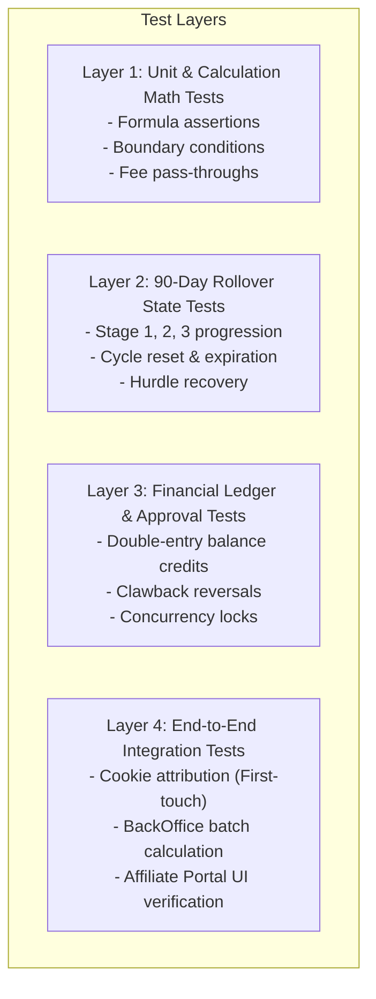

# ETSWalletV2 Affiliate Management System: QA Testing & Verification Matrix

**Document Version:** 1.0.0  
**Target Audience:** QA Engineers, Test Automation Specialists, Financial Auditors, Release Engineers  
**Related Documents:**
- `01_BUSINESS_REQUIREMENTS_SPECIFICATION.md`
- `02_TECHNICAL_ARCHITECTURE_AND_DATA_MODELS.md`
- `03_COMMISSION_CALCULATION_AND_LOGIC_ENGINE.md`
- `05_BACKOFFICE_ADMIN_AND_WORKFLOW_GUIDE.md`

---

## 1. QA Strategy & Testing Scope

The verification strategy ensures mathematical accuracy, data integrity across ledger transactions, resilience against fraud, and responsiveness across the affiliate portal UI.



---

## 2. Comprehensive Test Verification Matrix

### 2.1 Module: Referral Tracking & Member Attribution

| Test Case ID | Test Title | Test Steps | Expected Outcome | Severity |
| :--- | :--- | :--- | :--- | :---: |
| **TC-ATT-001** | First-Touch Referral Cookie Setting | 1. Clear browser cookies.<br>2. Visit `/?aff=AFF8888`.<br>3. Inspect browser cookies in DevTools. | `SiteAff` cookie is created with value `AFF8888`, `Max-Age=30 Days`, `HttpOnly=True`, `SameSite=Lax`. | Critical |
| **TC-ATT-002** | First-Touch Persistence (Non-Overwriting) | 1. Ensure `SiteAff=AFF8888` is present.<br>2. Visit `/?aff=AFF9999` using a competitor affiliate link.<br>3. Inspect cookies. | `SiteAff` retains original value `AFF8888`. It is **not** overwritten by `AFF9999`. | Critical |
| **TC-ATT-003** | Member Registration Attribution Linkage | 1. With `SiteAff=AFF8888` active, complete registration form.<br>2. Submit `POST /Register`.<br>3. Inspect `MemberUser` table in DB. | Newly created member record has `AffiliateId` matching `AFF8888` and `AffiliateCode = 'AFF8888'`. | Critical |
| **TC-ATT-004** | Ad Postback Parameter Capture | 1. Visit `/?aff=AFF8888&clickid=CLK12345&rtid=RT987`.<br>2. Inspect cookies. | `clickid` and `rtid` cookies are saved and retained alongside `SiteAff`. | Medium |

---

### 2.2 Module: Commission Calculation & Tier Matching

| Test Case ID | Test Title | Test Steps | Expected Outcome | Severity |
| :--- | :--- | :--- | :--- | :---: |
| **TC-CALC-001** | Standard Single-Period Tier Matching | 1. Seed 5 members under Affiliate A.<br>2. Total Bet: \$100,000, Total Win: \$70,000 (Company GGR: \$30,000).<br>3. Tier 1 hurdle is \$10,000 (20%), Tier 2 is \$25,000 (30%).<br>4. Run calculation. | Tier 2 matched. Net Win/Loss = \$30,000. CommissionRate = 30%. Adjusted net loss correctly calculated. | Critical |
| **TC-CALC-002** | Hurdle Not Reached (\$0 Commission) | 1. Total Bet: \$50,000, Total Win: \$45,000 (Company GGR: \$5,000).<br>2. Lowest Tier hurdle is \$10,000.<br>3. Run calculation. | No tier matched. `CommissionAmount = $0.00`. GGR carry forward record created with `CarriedForwardGGR = $5,000.00`, `Status = Active (1)`. | Critical |
| **TC-CALC-003** | Negative GGR Handling (Players Won) | 1. Total Bet: \$80,000, Total Win: \$100,000 (Company GGR: -\$20,000).<br>2. Run calculation. | `CommissionAmount = $0.00`. Negative GGR of -\$20,000 logged to carry-forward ledger with `Status = Active (1)`. | Critical |
| **TC-CALC-004** | Maximum Commission Cap Enforcement | 1. Tier 2 specifies `MaximumCommissionAmount = $15,000.00`.<br>2. Adjusted Net Loss yields gross commission of \$24,000.00.<br>3. Run calculation. | Final `CommissionAmount` is capped exactly at \$15,000.00. Notes field records cap application. | High |
| **TC-CALC-005** | Bonus Bet Separation Rule | 1. Deposit Bet: \$100,000, Deposit Win: \$80,000 (DepositGGR: \$20,000).<br>2. Bonus Bet: \$50,000, Bonus Win: \$10,000 (BonusGGR: \$40,000).<br>3. Run calculation. | `CurrentPeriodGGR` evaluates purely to DepositGGR (\$20,000). Bonus profit is not mixed into payable commission base. | High |

---

### 2.3 Module: 90-Day Staged GGR Carry Forward & Expiration

| Test Case ID | Test Title | Test Steps | Expected Outcome | Severity |
| :--- | :--- | :--- | :--- | :---: |
| **TC-CF-001** | Stage 1 to Stage 2 Rollover | 1. Group activated on 2026-01-01.<br>2. Period 2026-01 (Stage 1): GGR = -\$10,000.<br>3. Calculate Period 2026-02 (Stage 2): GGR = +\$15,000. | In Stage 2, `PreviousCarriedGGR = -$10,000`. `AccumulatedGGR = 15,000 + (-10,000) = $5,000.00`. | Critical |
| **TC-CF-002** | Hurdle Reached in Stage 2 (Prior Records Marked Used) | 1. Continuing TC-CF-001 with Stage 2 GGR = +\$40,000.<br>2. `AccumulatedGGR = 40,000 + (-10,000) = $30,000.00` (Meets Tier 2).<br>3. Run calculation. | Commission paid on \$30,000 base. 2026-01 carry forward record is updated to `Status = Used (2)`. | Critical |
| **TC-CF-003** | 90-Day Cycle Expiration (Reset to Zero) | 1. Month 1 (Stage 1): GGR = -\$15,000.<br>2. Month 2 (Stage 2): GGR = -\$5,000 (Accumulated: -\$20,000).<br>3. Month 3 (Stage 3): GGR = +\$10,000 (Accumulated: -\$10,000, Hurdle missed).<br>4. Calculate Month 4 (New Cycle 2, Stage 1). | Previous cycle records updated to `Status = Expired (3)`. Month 4 starts with `PreviousCarriedGGR = $0.00`. | Critical |

---

### 2.4 Module: Financial Approval & Double-Entry Ledger Workflows

| Test Case ID | Test Title | Test Steps | Expected Outcome | Severity |
| :--- | :--- | :--- | :--- | :---: |
| **TC-LED-001** | Statement Approval & Balance Credit | 1. Locate Pending Report ID 101 with `CommissionAmount = $10,200.00`.<br>2. Affiliate initial balance = \$5,000.00.<br>3. Admin clicks "Approve". | 1. Report `Status = Approved (2)`.<br>2. `Affiliate.Balance` becomes \$15,200.00.<br>3. Entry created in `AffiliateTransactions` with `ReferenceNumber = EV-CA-...`, `CreditType = Increase (2)`, `Amount = $10,200.00`, `Balance = $15,200.00`. | Critical |
| **TC-LED-002** | Post-Approval Clawback / Rejection | 1. Report 101 was previously Approved (Balance: \$15,200.00).<br>2. Admin identifies syndicate betting and clicks "Reject". | 1. Report `Status = Rejected (4)`.<br>2. `Affiliate.Balance` reduced by \$10,200.00 back to \$5,000.00.<br>3. Entry created in `AffiliateTransactions` with `ReferenceNumber = EV-CR-...`, `CreditType = Deduct (1)`, `Amount = $10,200.00`, `Balance = $5,000.00`. | Critical |
| **TC-LED-003** | Paid Statement Immutable Guard | 1. Mark Report 101 as `Status = Paid (3)`.<br>2. Attempt to invoke `ApproveCommission` or `RejectCommission` via API. | System rejects request with HTTP 400: "Commission report is already paid. Cannot reject or approve." | High |

---

## 3. Concrete Numerical Test Vectors for Automation

Automation scripts (e.g., xUnit, NUnit, Postman) should execute against the following predefined test vectors:

### Test Vector 1: Standard Commission Calculation
```json
{
  "groupSettings": {
    "depositFeeRate": 2.00,
    "withdrawFeeRate": 1.00,
    "validPeriod": 90
  },
  "tierSettings": [
    { "minWin": 30000.00, "rate": 30.00, "royalty": 10.00, "maxCap": 15000.00 },
    { "minWin": 10000.00, "rate": 20.00, "royalty": 10.00, "maxCap": 5000.00 }
  ],
  "inputs": {
    "depositBet": 200000.00,
    "depositWin": 160000.00,
    "memberDeposits": 80000.00,
    "memberWithdrawals": 40000.00,
    "previousCarriedGGR": 0.00
  },
  "expectedOutputs": {
    "companyGGR": 40000.00,
    "matchedTierMinWin": 30000.00,
    "depositFee": 1600.00,
    "withdrawFee": 400.00,
    "totalTransactionFee": 2000.00,
    "royaltyFee": 4000.00,
    "adjustedNetLoss": 34000.00,
    "grossCommission": 10200.00,
    "finalCommissionAmount": 10200.00
  }
}
```

---

## 4. Direct Database SQL Verification Queries

QA engineers can verify financial state directly in SQL Server Management Studio (SSMS):

### 1. Verify Affiliate Balance Matches Double-Entry Ledger
```sql
SELECT 
    a.AffiliateId,
    a.AffiliateCode,
    a.Balance AS CurrentAffiliateBalance,
    COALESCE(SUM(CASE WHEN t.CreditType = 2 THEN t.Amount ELSE -t.Amount END), 0) AS CalculatedLedgerBalance,
    (a.Balance - COALESCE(SUM(CASE WHEN t.CreditType = 2 THEN t.Amount ELSE -t.Amount END), 0)) AS Discrepancy
FROM Affiliate a
LEFT JOIN AffiliateTransactions t ON a.AffiliateId = t.AffiliateId
GROUP BY a.AffiliateId, a.AffiliateCode, a.Balance;
```
*Expected Result:* `Discrepancy` must be **0.00** across all rows.

### 2. Verify Member Line-Item Proportions Match Master Report Total
```sql
SELECT 
    r.AffiliateCommissionReportId,
    r.CalculationPeriod,
    r.CommissionAmount AS MasterReportCommission,
    SUM(d.CommissionAmount) AS SummedDetailCommission,
    (r.CommissionAmount - SUM(d.CommissionAmount)) AS RoundingDifference
FROM AffiliateCommissionReport r
JOIN AffiliateCommissionDetail d ON r.AffiliateCommissionReportId = d.AffiliateCommissionReportId
GROUP BY r.AffiliateCommissionReportId, r.CalculationPeriod, r.CommissionAmount
HAVING ABS(r.CommissionAmount - SUM(d.CommissionAmount)) > 0.05;
```
*Expected Result:* Zero rows returned.

### 3. Verify Active 90-Day GGR Carry Forward Continuity
```sql
SELECT 
    cf.AffiliateId,
    cf.CalculationPeriod,
    cf.PeriodStage,
    cf.CurrentPeriodGGR,
    cf.PreviousCarriedGGR,
    cf.CarriedForwardGGR,
    cf.Status
FROM AffiliateCommissionGGRCarryForward cf
ORDER BY cf.AffiliateId, cf.CalculationPeriod;
```

---

## 5. QA Sign-Off Checklist & Acceptance Criteria

| Item # | Verification Criteria | Status | Sign-off Date |
| :---: | :--- | :---: | :---: |
| 1 | Referral tracking accurately attributes registrations without overwriting first-touch cookie. | [ ] | |
| 2 | Pure Company GGR is evaluated from Deposit wagers without bonus dilution. | [ ] | |
| 3 | Payment pass-through fees (Deposit % + Withdraw %) and royalties deduct accurately. | [ ] | |
| 4 | Multi-stage 90-day rollover carries forward negative GGR and resets at cycle boundaries. | [ ] | |
| 5 | Commission approval immediately credits partner balance and creates immutable `CA` transaction. | [ ] | |
| 6 | Commission clawback on approved report deducts balance and creates immutable `CR` transaction. | [ ] | |
| 7 | Affiliate Portal UI displays accurate statements, filterable downline member lists, and breakdown modals. | [ ] | |
| 8 | Multi-language localization and tenant branding function without broken tokens. | [ ] | |
| 9 | Endpoints enforce role authorization, CSRF protection, and administrative IP whitelisting. | [ ] | |
